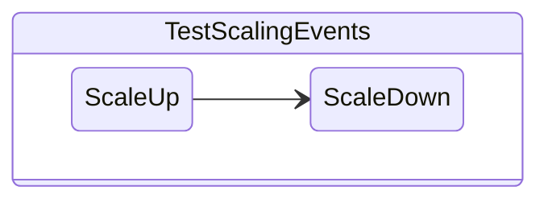
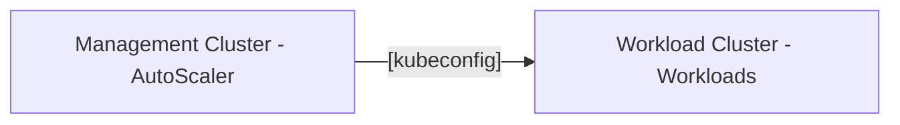

# Testing Autoscaling Functionality


!!!warning
          As of April 2023, Autoscaling is a ``yet to be validated`` feature and it is ``not intended`` for production purposes.

          For updates follow this Nutanix [Opendocs](https://opendocs.nutanix.com/capx/v1.1.x/experimental/autoscaler/) document.

## Section Flow



We will run with the following configuration:

1. The Management cluster runs the Autoscaler 
2. The worker nodes runs the workloads
3. The Autoscaler on the management cluster monitors the resource requirements of the workloads in the workload cluster and scales up and scales in the worker nodes in the workload cluster



## Deploy AutoScaler on Management Cluster

1. Download the AutoScaler manifest
   
    ```bash
    curl -OL https://raw.githubusercontent.com/kubernetes/autoscaler/master/cluster-autoscaler/cloudprovider/clusterapi/examples/deployment.yaml
    ```

2. Set your environment variables for the Autoscaler image you would like to use 
   
    ```bash
    export AUTOSCALER_IMAGE="us.gcr.io/k8s-artifacts-prod/autoscaling/cluster-autoscaler:v1.24.1"
    ```
 
    !!!info
           Other versions of ``Autoscaler`` images can be found [here](https://github.com/kubernetes/autoscaler/releases).


3. Modify and add (where necessary) the following highlighted sections of the ``deployment.yaml`` file (specifically inside the container section)
   
    ```yaml hl_lines="6-21"
    containers:
       - image: ${AUTOSCALER_IMAGE}
         name: cluster-autoscaler
         command:
         - /cluster-autoscaler
         args:
             - --cloud-provider=clusterapi
             - --kubeconfig=/mnt/kubeconfig/kubeconfig.yml
             - --clusterapi-cloud-config-authoritative
             - -v=1
         volumeMounts:
             - mountPath: /mnt/kubeconfig
               name: kubeconfig
               readOnly: true
       volumes:
           - name: kubeconfig
             secret:
                 secretName: ${WORKLOAD_CLUSTER_NAME}-kubeconfig # (1)
                 items:
                     - key: value
                       path: kubeconfig.yml
    ```

    1.  :material-fountain-pen-tip: Make sure to use the name/env. variable of your workload cluster. Another easy way to find the secret name, to be used, is to run the command ``kubectl get secrets -n $AUTOSCALER_NS``.


4. Check the manifest to make sure you have included all details, and apply the ``Autoscaler`` deployment manifest
 
    ``` bash
    kubectl apply -f deployment.yaml 
    ```

    Make sure the autoscaler pod is running 
 
    ``` { .bash .no-copy }
    k get po -n ${AUTOSCALER_NS}  
    #                                                                            
    NAME                                  READY   STATUS    RESTARTS   AGE
    cluster-autoscaler-6dbb469585-4ggtd   1/1     Running   0          7s
    ```
   
    !!!warning
              Do not proceed if the ``Autoscaler`` pod has issues starting, troubleshoot and fix before moving on to the next section.

We have prepared the Autoscaler resource to manage resources in our workload cluster.

## Capacity Management

As a responsible Solution Architect and an Administrator you need to do plan for resources and manage capacity as well. 

For this reason let us assume that you have decided that you will provide the following resources to the application team.

<table>
<thead>
  <tr>
    <th></th>
    <th>VMs</th>
  </tr>
</thead>
<tbody>
  <tr>
    <td>High Limit</td>
    <td>5</td>
  </tr>
  <tr>
    <td>Low Limit</td>
    <td>1</td>
  </tr>
</tbody>
</table>

To apply this capacity in the Autoscaler we need to set annotations in ``MachineDeployment`` resource.

Edit the ``MachineDeployment`` resource using the following command 

```bash
kubectl edit MachineDeployment ${WORKLOAD_CLUSTER_NAME}-wmd -n ${AUTOSCALER_NS}
```
Under the ``metadata`` section paste the following two lines:

```yaml
cluster.x-k8s.io/cluster-api-autoscaler-node-group-max-size: "5"
cluster.x-k8s.io/cluster-api-autoscaler-node-group-min-size: "1"
```

Your MachineDeployment metadata section would look something like this 
``` { .yaml .no-copy} 
apiVersion: cluster.x-k8s.io/v1beta1
kind: MachineDeployment
metadata:
  annotations:
    cluster.x-k8s.io/cluster-api-autoscaler-node-group-max-size: "5" # (1)
    cluster.x-k8s.io/cluster-api-autoscaler-node-group-min-size: "1" # (2)
```

1.  :material-transfer-up: Specifies maximum number of worker nodes to scale up to 
2.  :material-transfer-down: Specifies minimum number of worker nodes 

## Testing Scaling Events

Now comes the fun part that we have been setting up for. 

Let us deploy a test workload on our workload cluster and check if scaling events actually work.

1. Apply the following workload manifest
   
    ```bash
    k --kubeconfig ${WORKLOAD_CLUSTER_NAME}.cfg apply -f https://k8s.io/examples/application/php-apache.yaml
    ```
 
    This will start just one pod.

2. Scale up this Deployment to 100 pods which will require more than one worker node worth of resources
   
    ```bash
    k --kubeconfig ${WORKLOAD_CLUSTER_NAME}.cfg scale deployment php-apache --replicas 100
    ```

3. Watch the AutoScaler ``PHASE`` column in the output
    
    ```bash title="Sample output"
    kubectl get MachineDeployment -A        
    ```
    ```{ .bash .no-copy }
    NAMESPACE           NAME           CLUSTER    REPLICAS   READY   UPDATED   UNAVAILABLE   PHASE       AGE   VERSION
    ${AUTOSCALER_NS}    kubevip3-wmd   kubevip3   5          4       5         1             ScalingUp   22h   v1.24.11
    ```

4.  Watch the AutoScaler logs by running the following command
     
    === "Command Template"

        ```bash
        k logs <name of your AutoScaler pod> -n ${AUTOSCALER_NS}  -f # (1)
        ```

    === "Command Sample"

        ``` { .text .no-copy }
        k logs cluster-autoscaler-6dbb469585-4ggtd -n ${AUTOSCALER_NS}  -f 
        #
        #
        I0413 09:32:53.208911       1 scale_up.go:472] Estimated 5 nodes needed in MachineDeployment/kubevip3ns /kubevip3-wmd
        I0413 09:32:53.406155       1 scale_up.go:595] Final scale-up plan: [{MachineDeployment/kubevip3ns /kubevip3-wmd 1->5 (max: 5)}]
        I0413 09:32:53.406215       1 scale_up.go:691] Scale-up: setting group MachineDeployment/$kubevip3ns /kubevip3-wmd size to 5
        W0413 09:33:04.902674       1 clusterapi_controller.go:469] Machine "kubevip3-wmd-57fcdf9f7xbgz8z-kcx9h" has no providerID
        W0413 09:33:04.902700       1 clusterapi_controller.go:469] Machine "kubevip3-wmd-57fcdf9f7xbgz8z-m88fl" has no providerID
        W0413 09:33:04.902708       1 clusterapi_controller.go:469] Machine "kubevip3-wmd-57fcdf9f7xbgz8z-mlwb6" has no providerID
        W0413 09:33:04.902713       1 clusterapi_controller.go:469] Machine "kubevip3-wmd-57fcdf9f7xbgz8z-rthbj" has no providerID                                                                                      
        ```

5. You can also watch all the 100 pods now running using the following command

     ``` { .bash .no-copy }
     k --kubeconfig ${WORKLOAD_CLUSTER_NAME}.cfg get pods       
     ```
     ``` { .text .no-copy }                                                      
     NAME                          READY   STATUS             RESTARTS   AGE
     php-apache-698db99f59-24mqp   1/1     Running            0          17m
     php-apache-698db99f59-2pcpz   1/1     Running            0          17m
     php-apache-698db99f59-2vt28   1/1     Running            0          17m
     php-apache-698db99f59-2x8zs   1/1     Running            0          17m
     php-apache-698db99f59-44tf4   1/1     Running            0          17m
     php-apache-698db99f59-45vcp   1/1     Running            0          17m
     php-apache-698db99f59-4f9j6   1/1     Running            0          17m
     ```

6. Let us check the number of nodes in the workload cluster and see that it has been scaled up to 5 
    
    ``` { .bash .no-copy }
    k --kubeconfig ${WORKLOAD_CLUSTER_NAME}.cfg get nodes                                                                 
    NAME                                 STATUS   ROLES           AGE     VERSION
    kubevip3-kcp-jnhf5                   Ready    control-plane   22h     v1.24.11
    kubevip3-kcp-p56j9                   Ready    control-plane   22h     v1.24.11
    kubevip3-kcp-z8pqj                   Ready    control-plane   22h     v1.24.11
    kubevip3-wmd-57fcdf9f7xbgz8z-9mf59   Ready    <none>          7m51s   v1.24.11
    kubevip3-wmd-57fcdf9f7xbgz8z-kcx9h   Ready    <none>          19m     v1.24.11
    kubevip3-wmd-57fcdf9f7xbgz8z-m88fl   Ready    <none>          19m     v1.24.11
    kubevip3-wmd-57fcdf9f7xbgz8z-mlwb6   Ready    <none>          19m     v1.24.11
    kubevip3-wmd-57fcdf9f7xbgz8z-pqp8s   Ready    <none>          22h     v1.24.11
    ```

7. Now we can test a scale down event to see if AutoScaler is communicating with Prism Central APIs to delete VMs that are not necessary

    ```bash
    k --kubeconfig ${WORKLOAD_CLUSTER_NAME}.cfg scale deployment php-apache --replicas 10
    ```

8. Watch the Node count, pods count, and Deployment logs as before.

You have experienced one of your many serverless compute experience. 

Do come back to this site check for more updates.