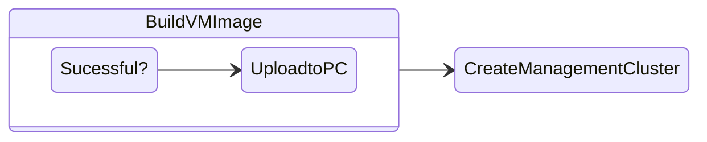

# Build Kubernetes VM Image

In this section we will build a VM image using Hashicorp Packer Automation.



This image will be uploaded to Prism Central which will then be used by ``clusterctl`` utility to build VMs upon which Kubernetes will be deployed.

Since the image needs quite a bit of packages to be installed it makes sense for this process to be automated. It is a good idea to have this image immutable so production workloads are not disturbed by OS or software upgrades. 

Packages include the following (not limited to):

- Kubernetes binaries (version determined by logic in this ``image-builder/images/capi/hack/image-new-kube.py`` script -  you will download as you follow steps in this lab)
- CSI drivers
- Containerd binaries

## Steps to Building Image

!!!note
       All steps to build the VM image are from **Nutanix** section of the Open Source [Image Builder Book](https://image-builder.sigs.k8s.io/capi/providers/nutanix.html#configuration)

1. Login to your workstation 
   
2. Ensure you have git installed
   
    ```bash
    yum install git
    ```
   
3. Clone this repository
    
    ```bash
    git clone https://github.com/kubernetes-sigs/image-builder.git
    ```

4. Run the command to install Ansible and Packer
   
    ```bash 
    cd image-builder/images/capi/
    make deps-nutanix
    ```

5. Change to the following directory and provide your Nutanix Prism Central information. This is where you will build and store the image
   
    ```bash
    cd packer/nutanix/
    vi nutanix.json
    ```
    
    ```json
    {
     "force_deregister": "true",
     "nutanix_cluster_name": "Name of PE Cluster",
     "nutanix_endpoint": "Prism Central IP / FQDN",
     "nutanix_insecure": "true",
     "nutanix_password": "PrismCentral_Password",
     "nutanix_port": "9440",
     "nutanix_subnet_name": "Name of Subnet",
     "nutanix_username": "PrismCentral_Username",
     "scp_extra_vars": ""
    }
    ```
6. Once this file is saved with your Nutanix cluster specific information. Run the following command to intialise and build the image.
   
    ```bash
    make build-nutanix-ubuntu-2204
    ```
    !!!tip
           You can also logon to Prism Central UI to check the **Tasks** to see the Image build activities.

    ```bash title="Command output - This will take about 13 minutes"
    < output snipped　>
    ==> nutanix: Creating image(s) from virtual machine ubuntu-2204-kube-v1.24.11...
     nutanix: Found disk to copy: SCSI:0
     nutanix: Image successfully created: ubuntu-2204-kube-v1.24.11 (ec76c3ce-57c9-4f4f-b9fb-1e3f92157280)
    ==> nutanix: Deleting virtual machine...
        nutanix: Virtual machine successfully deleted
    ==> nutanix: Running post-processor: custom-post-processor (type shell-local)
    ==> nutanix (shell-local): Running local shell script: /var/folders/fn/40xgq_sx74s6qbr42534mbwc0000gn/T/packer-shell2304847137
    Build 'nutanix' finished after 13 minutes 23 seconds.
    
    ==> Wait completed after 13 minutes 23 seconds
    
    ==> Builds finished. The artifacts of successful builds are:
    --> nutanix: ubuntu-2204-kube-v1.24.11
    --> nutanix: ubuntu-2204-kube-v1.24.11  # <<< note this down
    ```

You can use the ``ubuntu-2204-kube-v1.24.11`` image name in the next section to create VMs on which you will install Kubernetes.
    
