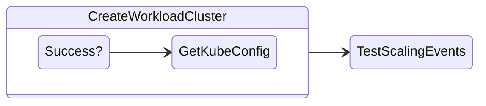

# Creating a Workload Cluster

In this section we will create a Workload cluster. 

This workload cluster will be deployed from the Mangement cluster that we created in the previous section.



1. Make sure your Kubernetes context is that of the your Management cluster.
   
    ```bash
    export KUBECONFIG=${MGMT_KUBECONFIG_FILE}
    ```
    ```bash title="Run additional commands to make sure you are the Management cluster"
    kubectl get nodes
    kubectl get ns
    ```

4. Reserve a new Control Plane endpoint IP for your Kubernetes cluster.
   
    ```bash
    export WORKLOAD_CLUSTER_NAME=mycluster
    export WORKLOAD_CLUSTER_NS=mynamespace
    ```

5. Generate your kubernetes clusters configuration file

    ```bash
    CONTROL_PLANE_ENDPOINT_IP=x.x.x.x clusterctl generate cluster ${WORKLOAD_CLUSTER_NAME} --flavor ccm \
    -i nutanix \
    --target-namespace ${WORKLOAD_CLUSTER_NS}  \
    --kubernetes-version v1.24.11 \
    --control-plane-machine-count 1 \
    --worker-machine-count 3 > ./cluster.yaml
    ```

7. Create a namespace in the management cluster where the workload cluster can be managed

    ```bash
    kubectl create ns ${WORKLOAD_CLUSTER_NS}
    ```

8.  Apply the ``cluster.yaml`` manifest to create your workload cluster in the Nutanix infrastructure
   
    ```bash
    k apply -f cluster.yaml                                                                  
    ```
 
    ```bash
    # Output
    configmap/user-ca-bundle created
    configmap/nutanix-ccm created
    secret/mycluster created
    secret/nutanix-ccm-secret created
    clusterresourceset.addons.cluster.x-k8s.io/nutanix-ccm-crs created
    kubeadmconfigtemplate.bootstrap.cluster.x-k8s.io/mycluster-kcfg-0 created
    cluster.cluster.x-k8s.io/mycluster created
    machinedeployment.cluster.x-k8s.io/mycluster-wmd created
    machinehealthcheck.cluster.x-k8s.io/mycluster-mhc created
    kubeadmcontrolplane.controlplane.cluster.x-k8s.io/mycluster-kcp created
    nutanixcluster.infrastructure.cluster.x-k8s.io/mycluster created
    nutanixmachinetemplate.infrastructure.cluster.x-k8s.io/mycluster-mt-0 created
    ```

9.  You can observe the creation of the VMs in the Prism Central/Element
   
10. Download the kubeconfig for workload cluster by running the following command
    
    ```bash
    clusterctl get kubeconfig ${WORKLOAD_CLUSTER_NAME} -n ${WORKLOAD_CLUSTER_NS} > ${WORKLOAD_CLUSTER_NAME}.kubeconfig
    kubectl --kubeconfig ./${WORKLOAD_CLUSTER_NAME}.kubeconfig get nodes
    ``` 

11. Watch the nodes in the cluster until all the nodes come up (1 control plane and 3 workers unless you modified the ``clusterctl.yaml`` file)
   
    ```bash
    kubectl --kubeconfig ./${WORKLOAD_CLUSTER_NAME}.kubeconfig get nodes -w
    ```

12. Once the desired number of nodes are present, you will see that these will be in a ``NotReady`` state. 
    
     ```bash
     k --kubeconfig mycluster.cfg get nodes                                              
     NAME                                 STATUS     ROLES           AGE     VERSION
     mycluster-kcp-jnhf5                   NotReady   control-plane   4m43s   v1.24.11
     mycluster-kcp-p56j9                   NotReady   control-plane   6m19s   v1.24.11
     mycluster-kcp-z8pqj                   NotReady   control-plane   2m13s   v1.24.11
     mycluster-wmd-57fcdf9f7xbgz8z-nkf45   NotReady   <none>          5m27s   v1.24.11
     mycluster-wmd-57fcdf9f7xbgz8z-pq47m   NotReady   <none>          5m21s   v1.24.11
     mycluster-wmd-57fcdf9f7xbgz8z-pqp8s   NotReady   <none>          5m23s   v1.24.11
     ```

    For the nodes to become ready you need to install CNI. You must deploy a Container Network Interface (CNI) based pod network add-on so that your pods can communicate with each other. Cluster DNS (CoreDNS) will not start up before a network is installed.

13. Run the following command to install [Calico CNI](https://cluster-api.sigs.k8s.io/user/quick-start.html?highlight=cni#deploy-a-cni-solution).
   
     ```bash
     kubectl --kubeconfig ./${WORKLOAD_CLUSTER_NAME}.kubeconfig apply -f https://raw.githubusercontent.com/projectcalico/calico/v3.24.1/manifests/calico.yaml
     ```

14. Upon successful install of CNI, the nodes will get to a ``READY`` state. (it might take a minute or two depending on the resources available to your VMs)

15. Confirm the state of your workload Kubernetes cluster
    
     ```bash
     kubectl --kubeconfig ./${WORKLOAD_CLUSTER_NAME}.kubeconfig get nodes
     ```
     ```bash title="Output"
     NAME                                 STATUS   ROLES           AGE     VERSION
     mycluster-kcp-jnhf5                   Ready    control-plane   8m46s   v1.24.11
     mycluster-wmd-57fcdf9f7xbgz8z-gsw4z   Ready    <none>          116s    v1.24.11
     mycluster-wmd-57fcdf9f7xbgz8z-pq47m   Ready    <none>          9m24s   v1.24.11
     mycluster-wmd-57fcdf9f7xbgz8z-pqp8s   Ready    <none>          9m26s   v1.24.11
     ```

16. If you have any issues or wanting to delete any workload cluster you can use the following commands
    
    To delete a workload cluster
 
    ```bash
    kubectl delete cluster ${WORKLOAD_CLUSTER_NAME} -n ${WORKLOAD_CLUSTER_NS}
    ```